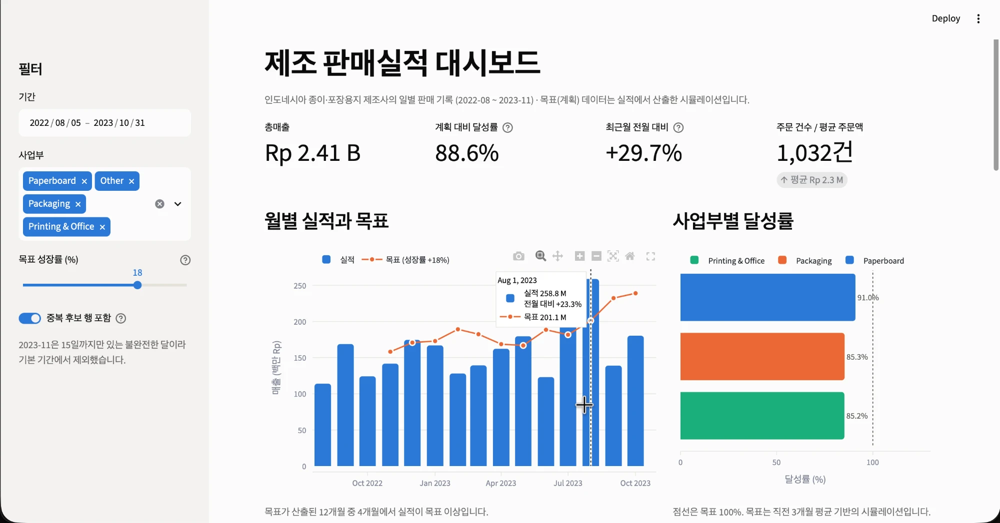
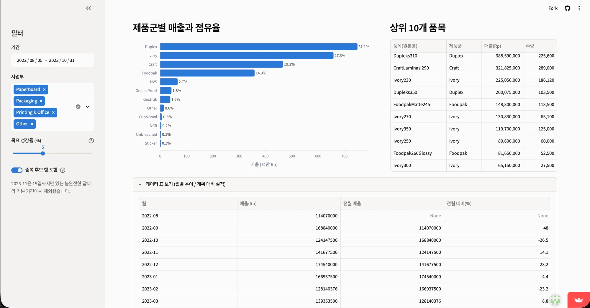

# 제조 판매실적 분석 대시보드

**[Live Demo](https://sales-dashboard-jisun.streamlit.app)** · 무료 호스팅이라 오래 접속이 없으면 잠들 수 있습니다. 화면이 멈춰 있으면 "Wake up" 버튼을 눌러 주세요.

제조업 판매 데이터를 **SQL로 적재·분석**하고 **Streamlit 대시보드**로 보여주는 개인 프로젝트입니다.
원천 데이터 → 정제·검증 → DB 적재 → SQL 분석 → 계획 대비 실적 대시보드까지의 흐름을 하나로 구현했습니다.

```
Raw CSV ──> ETL(정제·표준화) ──> SQLite(raw / clean 두 계층) ──> SQL 분석 쿼리 ──> Streamlit 대시보드
                └── 적재 후 검증(건수·합계·산식·분포)
```

## 화면


*KPI와 계획 대비 실적. 목표 성장률 슬라이더를 18%로 조절한 상태입니다.*


*제품군별 매출·점유율, 상위 품목, 차트의 데이터 표 보기.*

## 데이터

| 항목 | 내용 |
|---|---|
| 분야 | 종이·포장용지 제조업 (인도네시아 인쇄업체의 일별 판매 기록) |
| 기간 / 규모 | 2022-08 ~ 2023-11, 1,076행 (컬럼: 날짜, 제품, 수량, 단가, 총액) |
| 출처 | Jabir Muktabir, [Data Penjualan Produk Cetakan](https://www.kaggle.com/datasets/jabirmuktabir/data-penjualan-produk-cetakan), Kaggle |
| 라이선스 | Apache License 2.0 — 원본 파일은 수정 없이 `data/raw/`에 두었고 고지문은 [`NOTICE.md`](data/raw/NOTICE.md) 참고 |

**이 프로젝트에서 만든 데이터 (원본에 없음)**
- **사업부 구분**: 제품 성격(판지 / 포장재 / 인쇄·사무용지)으로 직접 묶은 분류입니다. 실제 기업의 조직 구분이 아닙니다.
- **목표(계획)**: `직전 3개월 평균 매출 x (1 + 성장률)`로 산출한 **시뮬레이션**입니다. 성장률은 대시보드에서 조절합니다.
- 통화는 인도네시아 루피아(Rp)이며, `B`는 10억, `M`은 100만입니다.

## 주요 기능

- KPI: 총매출, 계획 대비 달성률, 최근월 전월 대비, 주문 건수
- 월별 실적 vs 목표, 사업부별 달성률, 제품군별 매출·점유율, 상위 품목
- 필터: 기간, 사업부, 목표 성장률 슬라이더, 중복 후보 행 포함 여부
- 차트의 데이터 표 보기, 데이터 출처·변경 사항 표기

## 실행 방법

```bash
python3 -m venv .venv && source .venv/bin/activate
pip install -r requirements.txt
python src/etl.py        # 정제 + DB 생성 (data/sales.db)
python src/validate.py   # 적재 검증 (6개 항목)
streamlit run app.py
```

## 구조

```
app.py                         Streamlit 화면 (SQL은 포함하지 않음)
src/etl.py                     추출 → 정제·표준화 → 적재
src/validate.py                원본 vs DB 정합성 검증
src/db.py                      sql 파일의 이름 붙은 쿼리 로더
sql/01_create_tables.sql       raw_sales(원본 보존) / sales(정제) 스키마, 인덱스
sql/02_dimensions_targets.sql  제품군-사업부 매핑, 분석 뷰, 목표 기준선
sql/03_sales_analysis.sql      분석 쿼리 (CTE, 윈도우 함수, JOIN)
docs/DECISIONS.md              단계별 분석·설계 판단과 근거
```

## 데이터 처리에서 내린 판단

- 정제 규칙은 **프로파일링에서 확인된 문제에만** 적용했습니다 (날짜 형식, 제품명 94종 표기 불일치).
- 날짜는 `DD/MM/YYYY`로 명시해 월·일 혼동을 막고 ISO 형식으로 저장했습니다.
- 중복 40행은 주문번호가 없어 진짜 중복인지 알 수 없으므로 **삭제하지 않고 표시**했습니다.
- 원본과 정제 결과를 **두 계층**으로 저장해 규칙이 틀려도 재처리할 수 있게 했습니다.
- 첫 검증은 통과했지만 분류 결과의 분포를 확인하다 정규식 버그를 발견해 수정했습니다 (미분류 99건 → 10건).

자세한 근거와 회고는 [`docs/DECISIONS.md`](docs/DECISIONS.md)에 있습니다.

## 한계

- 1,076행 규모라 대용량 처리를 검증한 것은 아닙니다.
- 목표와 사업부 구분은 가정에 기반한 시뮬레이션이며 실제 기업의 계획·조직 데이터가 아닙니다.
- 2023-11은 15일까지의 데이터라 기본 조회 기간에서 제외했습니다.

## 라이선스

코드는 [MIT License](LICENSE)입니다. 데이터(`data/raw/`)는 원저작자의 Apache License 2.0을 따릅니다.
